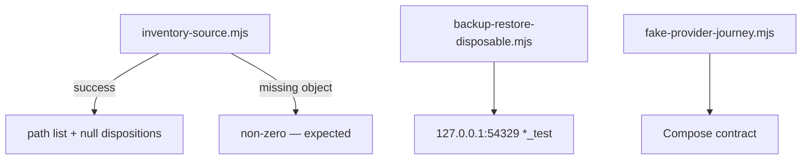

# Sentra Bot scripts

Project-scoped backup, restore, migration, and release helpers belong here.
Scripts must use the **root** toolchain and must not access production
credentials or source runtime data.

## CURRENT

[inventory-source.mjs](inventory-source.mjs) — fail-closed `git ls-tree` of
pin `d17a138`. Usage: [../docs/source-inventory.md](../docs/source-inventory.md).

[backup-restore-disposable.mjs](backup-restore-disposable.mjs) — guarded
`pg_dump`/`pg_restore` for `127.0.0.1:54329` `*_test` databases only.

[fake-provider-journey.mjs](fake-provider-journey.mjs) — Compose YAML
invariants plus concurrent fake execution without provider credentials.

Operator-host Compose volume backup/restore remains an
[operations.md](../docs/operations.md) **gate**.

Do not add scripts that `docker exec` production, print `DATABASE_URL`, or
walk `D:/DEV/Sentraverse/sentrabot` working trees as a substitute for the
pinned object.
