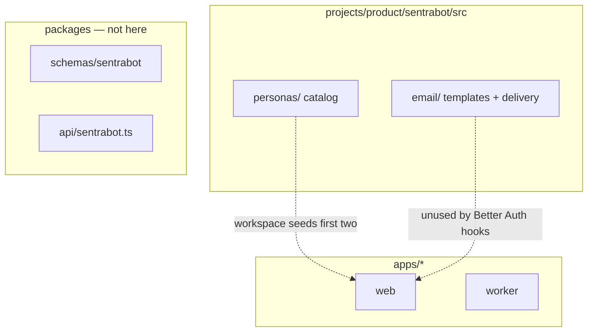

# Capsule `src/` boundary

Product **deployment** runtimes belong under `apps/`. Shared domain types
belong in `@safrs/*`. This `src/` tree is for capsule-owned libraries that
are not a fifth application: personas and email helpers today.

The migration must not create `projects/product/sentrabot/packages`, a nested
workspace, or a second dependency-management stack.

## CURRENT contents

- `personas/` — twelve Indonesian assistant definitions; see
  [../docs/product.md](../docs/product.md). Web webpack aliases
  `@sentrabot/personas` here; `/workspace` imports the catalog and uses the
  first two entries as local sample bots.
- `email/` — verification and password-reset **text** templates;
  `deliverEmail` local sink vs provider flag. See [../emails/README.md](../emails/README.md).
- Colocated `*.test.ts` files exist; they are not a workspace package, so
  they are outside the documented `pnpm --filter` commands.

No second HTTP server lives here.
