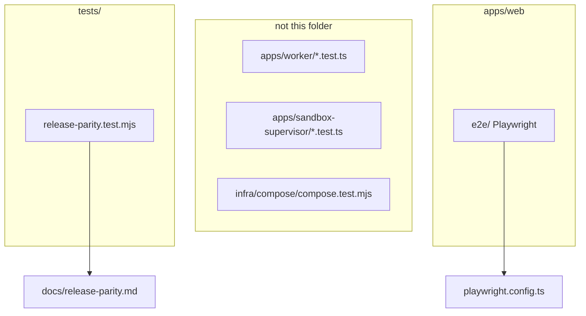

# Sentra Bot cross-app tests

Cross-app parity, topology, security, Compose, and end-to-end support tests
belong here. App-local unit and contract tests remain colocated with their
owning app (`apps/*/src/*.test.ts`, `src/**/*.test.ts`,
`infra/compose/compose.test.mjs`).

Tests use deterministic fakes by default and must not require production
credentials, source runtime data, or an internet-facing Docker socket.

CURRENT file: [release-parity.test.mjs](release-parity.test.mjs) — forbids
Rakazo identifiers in selected runtime files and requires
[../docs/release-parity.md](../docs/release-parity.md) to keep naming the
known blockers. This file is **not** in the root `tests/repository` glob or
`vitest.workspace.ts`, so Turbo package tests do not run it unless invoked
explicitly.

Playwright lives with the web app (`apps/web/playwright.config.ts`,
`apps/web/e2e`). Do not add production canaries that need live provider keys.
