# Gaffer Orchestration

## Purpose

Gaffer is the cost-aware coding orchestration layer on top of SAFRS. It turns a Chief's plain-language coding intent into a verified, SAFRS-compliant outcome while minimizing expected cost per verified accepted task.

SAFRS stays authoritative for governance, enforcement, evidence, and repository safety. Gaffer adds intent, SOLO/DECOMPOSE routing, task decomposition, economic worker routing, evidence-driven escalation, and final outcome coordination.

**Canonical:** `docs/architecture/GAFFER_ORCHESTRATION_FRAMEWORK.md` (v0.1).
**Runtime:** `tools/automation/src/gaffer/`.
**Skill:** `.agents/skills/gaffer-orchestration/SKILL.md`.

## Entry point

`/gaffer <intent>`

Chief does not choose models, workers, files, tests, routes, reviewers, or providers. The user picks none of the orchestration knobs; Gaffer hides that complexity.

Provider command adapters point at the canonical skill:

- `.claude/commands/gaffer.md`
- `.cursor/commands/gaffer.md`

## Runtime flow

```mermaid
flowchart LR
    User["Chief /gaffer intent"]
    Root["Root — intent + semantics"]
    Disc["Project discovery<br/>domain/capsule"]
    Pol["SAFRS policy + monotonic risk"]
    Route["SOLO | DECOMPOSE"]
    DAG["bounded task DAG<br/>(if decomposed)"]
    Worker["cheapest qualified<br/>ECONOMY | STRONG"]
    Verify["SAFRS verification<br/>+ evidence"]
    Accept["Root semantic acceptance"]
    Done["READY | BLOCKED"]

    User --> Root --> Disc --> Pol --> Route
    Route -->|solo| Worker
    Route -->|decompose| DAG --> Worker
    Worker --> Verify --> Accept --> Done
```

## Worker classes

| Class | Meaning | Default cost rank |
| --- | --- | --- |
| `ROOT` | Root executes solo; no delegation | 30 |
| `ECONOMY` | Cheapest certified adapter for bounded, testable, architecture-settled work | 10 |
| `STRONG` | Higher-cost class for high-risk, ambiguous, or cross-module work | 20 |

No `STANDARD` tier exists until telemetry demonstrates a need (framework §"v0.1 worker classes").

## Routing and escalation

`classifier.mjs` picks SOLO versus DECOMPOSE from route signals (unit count, separability, ambiguity, blast radius, delegation overhead). SOLO is the default when delegation overhead is not justified; DECOMPOSE applies when bounded tasks can reduce expected accepted-work cost.

`classifyWorker` assigns a task to ECONOMY only when it is bounded, testable, and architecture-settled. High-risk SAFRS classification or a high-risk tag (security, auth, billing, migration, production, infrastructure, concurrency) forces STRONG and overrides the cost preference.

`escalation.mjs` classifies failures rather than blindly retrying. A capability mismatch or security risk escalates an ECONOMY task to STRONG exactly once, then blocks. Scope violations, blocked requirements, and budget exhaustion block immediately. Retries are finite.

## Hard rules

- SAFRS remains the governance and enforcement authority.
- Workers cannot spawn workers.
- Workers may not silently expand scope.
- Dependent tasks require verified prerequisites.
- Retries are finite.
- No silent worker-class substitution.
- High-risk SAFRS classification overrides cost preference.
- Orchestration complexity stays hidden from the normal user.

## Key source files

| File | Purpose |
| --- | --- |
| `tools/automation/src/gaffer/constants.mjs` | Routes, worker classes, task states, failure classes, audit verdicts |
| `tools/automation/src/gaffer/classifier.mjs` | SOLO/DECOMPOSE route selection and ECONOMY/STRONG worker classification |
| `tools/automation/src/gaffer/runner.mjs` | Provider-neutral `runGaffer()` runtime |
| `tools/automation/src/gaffer/safrs-ports.mjs` | Gaffer ports wired to real SAFRS capabilities |
| `tools/automation/src/gaffer/provider-codex.mjs` | First activated provider (Codex), default Root/worker/audit callbacks |
| `tools/automation/src/gaffer/scheduler.mjs` | Task DAG with dependency readiness |
| `tools/automation/src/gaffer/escalation.mjs` | Evidence-driven retry/escalate/block decisions |
| `tools/automation/src/gaffer/router.mjs` | Cheapest-qualified worker resolution, no silent substitution |
| `tools/automation/src/gaffer/scope.mjs` | Changed-files-within-owned-paths enforcement |
| `tools/automation/src/gaffer/contracts.mjs` | Task-contract validation and worker-result validation |
| `tools/automation/src/gaffer/state.mjs` | Finite task-state machine |
| `tools/automation/src/gaffer/telemetry.mjs` | In-memory event ledger for Gaffer runs |

Implementation detail: [Gaffer runtime](../tools/gaffer.md).

## Current limits (be honest about these)

The v0.1 Codex provider's default callbacks (`provider-codex.mjs`) return simulated completion and a default `SHIP` audit verdict. They do not run a real agent or an independent review. Tests exercise the orchestration with injected callbacks, not production provider execution. Phase 4 (economic validation against a Root-only baseline) has not produced measurements yet. Do not treat the current wiring as production-ready execution.

## Related pages

- [Gaffer runtime](../tools/gaffer.md) — module-by-module implementation
- [Automation control plane](automation-control-plane.md) — SAFRS contracts, leases, gates, evidence Gaffer reuses
- [SAFRS governance](safrs-governance.md) — risk model and roles Gaffer consults
- [Project capsules](../projects/index.md) — the discovery target (`domain/capsule`)
