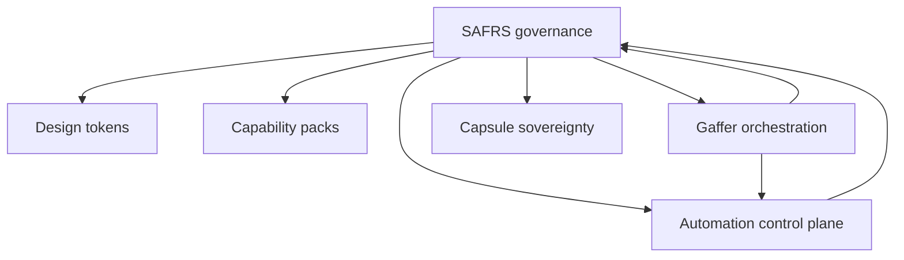

# Features — cross-cutting capabilities

Product-neutral capabilities that span capsules or the control plane.

1. **[SAFRS governance](safrs-governance.md)** — six layers, R0–R3, roles, registry, checkers.
2. **[Automation control plane](automation-control-plane.md)** — ADR 0002 contracts, leases, gates, evidence.
3. **[Gaffer orchestration](gaffer-orchestration.md)** — cost-aware intent → verified outcome on top of SAFRS.
4. **[Design tokens](design-tokens.md)** — `@sentra/token` authoring source; capsules must pin or snapshot.
5. **[Capability packs](capability-packs.md)** — optional Stripe, email, Electron, WXT, AI, Python for root-scaffolded projects.

Newer cross-cutting concerns (documented in dedicated sections, not this original four-pack):

- [Capsule sovereignty](../governance/capsule-sovereignty.md)
- [Standalone extraction](../verification/standalone.md)

