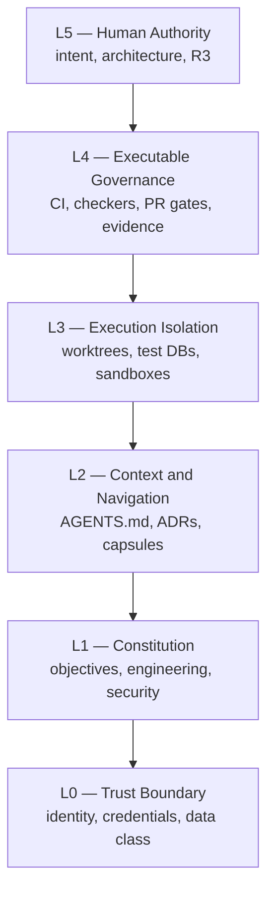
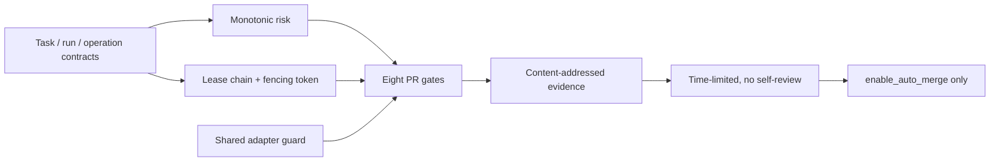
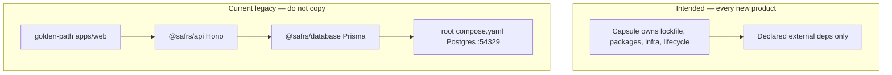
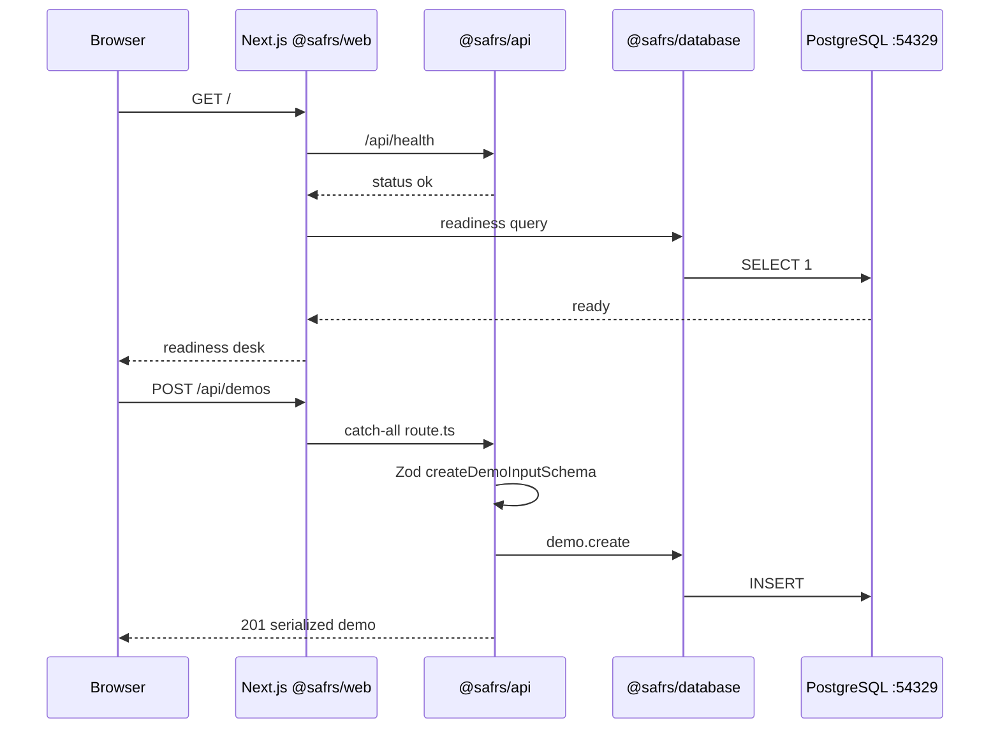

# Architecture

Two architectures sit in this repository. Do not mix them.

1. **SAFRS six-layer control architecture** — how agents are governed (`SAFRS_SPEC.md` §3).
2. **Capsule topology** — how products are owned (`MONOREPO_PURPOSE.md`, ADR 0005, ADR 0006).

`.agents/knowledge/03_ARCHITECTURE.md` still describes the **implemented solo-developer baseline** (golden-path + root packages). That is current-state for the legacy demonstrator, not the intended pattern for new products.

## Six-layer control architecture

Canonical: `SAFRS_SPEC.md` §3.



Constraint descends. Authority ascends. Capability is not trust.

## Automation control plane (ADR 0002)

Extends L4 with machine-checked task contracts. Implementation: `tools/automation/`. Schemas: `.safrs/schemas/`.



Identity separation: the coding agent never holds merge or production-execution authority. Publisher may only enable auto-merge for an exact verified head. R3 stays prepare-only for coding agents.

### Gaffer orchestration (v0.1)

On top of the automation control plane, [Gaffer orchestration](../features/gaffer-orchestration.md) routes a Chief's plain-language intent through SOLO/DECOMPOSE, cheapest-qualified worker routing (ECONOMY/STRONG), SAFRS verification, and Root semantic acceptance. Its runtime (`tools/automation/src/gaffer/`) reuses the SAFRS ports rather than re-implementing contracts, risk, leases, or evidence. The v0.1 Codex provider callbacks are simulated; economic validation is Phase 4.

## Repository topology

Canonical: `SAFRS_SPEC.md` §4, ADR 0005.

```text
projects/<domain>/          routing only (AGENTS.md + README.md)
└── <capsule>/              the portable project
packages/                   root shared packages (legacy / authoring)
tools/                      control-plane tooling
tests/                      repository integration tests
docs/                       canonical docs and ADRs
.safrs/                     machine policy
.agents/                    agent memory
```

Domains: `academic`, `corporate`, `healthcare`, `internal`, `product`. A domain folder with no capsule is a topology error.

pnpm workspace (`pnpm-workspace.yaml`):

- includes `packages/*`, `tools/*`, `projects/*/*/apps/*`
- **excludes** `academic-smartboard`, `kediri-history`, `sentrabot` so those capsules keep their own lockfiles

## Intended vs current runtime



Golden-path request path (legacy demonstrator only):



Mount point: `projects/internal/golden-path/apps/web/src/app/api/[[...route]]/route.ts`.

Product runtimes (SentraBot, Kediri, Avery) are documented under [projects](../projects/index.md). They do not use this Hono mount.

## CI (root)

Five workflows under `.github/workflows/`:

| Workflow | Trigger | Purpose |
| --- | --- | --- |
| `ci.yml` | pull_request | lint, typecheck, test, build, e2e (needs LFS + Postgres service) |
| `safrs-governance.yml` | pull_request, push to main | Python governance checkers |
| `safrs-pr-gates.yml` | pull_request, push to main | eight PR gates as matrix jobs |
| `safrs-task-control.yml` | workflow_dispatch | remote lease authority |
| `safrs-publish.yml` | workflow_dispatch | publication eligibility |

HANDOFF (2026-08-26) records that GitHub Free private-repo branch protection is blocked pending a billing decision. Do not infer that gates are required on GitHub.

## Related

- [Purpose](purpose.md)
- [Capsules](../projects/index.md)
- [Automation feature](../features/automation-control-plane.md)
- [Golden-path app](../apps/golden-path-web.md)
