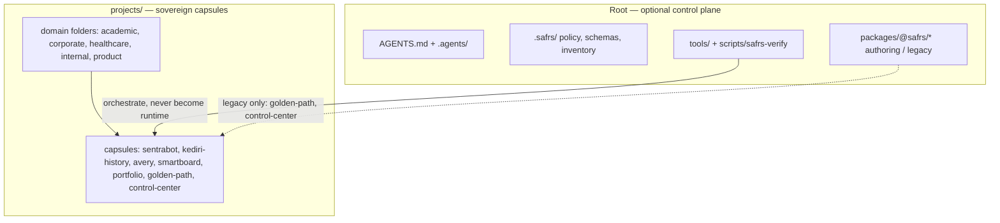

# SAFRS Monorepo overview

The SAFRS Monorepo lets one human Chief operate many software projects through autonomous AI engineering with machine-enforced constraints.

**Canonical purpose:** `docs/architecture/MONOREPO_PURPOSE.md`.
**Canonical specification:** `SAFRS_SPEC.md`.
**Canonical routing:** root `AGENTS.md`.

Wiki home: [README](../README.md).

## Operating model

**Human-Governed · Agent-Executed · Machine-Enforced**

- Chief defines objectives, policy, authority boundaries, and genuine high-impact decisions.
- Agents execute engineering inside that envelope.
- Machines enforce topology, verification, isolation, and evidence.

The monorepo succeeds only when it reduces Chief's operational burden. It must not turn Chief into a terminal operator or per-command approval service.

## Two layers (do not collapse them)

Deleting access to the root must not break an extracted capsule's normal lifecycle (invariants I-01 … I-03 in `MONOREPO_PURPOSE.md`).

## What lives here

| Area | Role |
| --- | --- |
| `projects/<domain>/<capsule>/` | Independently operable products |
| `packages/` | Product-neutral `@safrs/*` and `@sentra/token` for **legacy root-integrated** apps |
| `tools/` | Doctor, task, automation, SAFRS checkers, wizard, standalone verifier |
| `.safrs/` | Machine policy and JSON Schema contracts |
| `.agents/` | Agent memory (HANDOFF, decisions, lessons) — not runtime |
| `docs/` | Canonical architecture, ADRs, governance, plans |
| `tests/` | Repository integration and governance tests |
| `scripts/` | Root orchestration (`safrs-verify`, setup, dev) |
| `database/` | Gitignored medical-guideline corpus (not Prisma) |
| `sentrawiki/` | This wiki — derived navigation |

## Capsule inventory (current)

| Capsule | Domain | Standalone posture |
| --- | --- | --- |
| [sentrabot](../projects/sentrabot.md) | product | Own pnpm workspace; excluded from root workspace |
| [kediri-history](../projects/kediri-history.md) | product | Own pnpm workspace; excluded from root workspace |
| [academic-smartboard](../projects/academic-smartboard.md) | academic | Own pnpm workspace; excluded from root workspace |
| [portfolio-drnovia](../projects/portfolio-drnovia.md) | corporate | Contract present; vendored static site |
| [avery](../projects/avery.md) | healthcare | Hermes configuration capsule, not a Node app |
| [golden-path](../projects/golden-path.md) | internal | **Legacy root-coupled** demonstrator |
| [control-center](../projects/control-center.md) | internal | **Root-coupled** local operator UI |
| [_template](../projects/template.md) | n/a | Scaffold only |

Full map: [Project capsules](../projects/index.md).

## Tech stack (root control plane)

| Layer | Technology |
| --- | --- |
| Package manager | pnpm 11.21.0 (`packageManager` in root `package.json`) |
| Runtime | Node.js `>=24.18.0 <25` |
| Language | TypeScript (strict); Python 3 for governance checkers |
| Legacy demo web | Next.js 16 App Router, Node runtime |
| Legacy demo API | Hono 4 + `@hono/zod-validator` |
| Schema | Zod 4 (packages); JSON Schema 2020-12 (automation) |
| Legacy demo DB | PostgreSQL 17 via root `compose.yaml` on `127.0.0.1:54329` |
| Build | Turborepo 2 |
| Lint/format | Biome 2 |
| Test | Vitest 4, Playwright, Node `--test`, Python unittest |
| Observability | OpenTelemetry OTLP/HTTP to local Jaeger (optional) |
| CI | GitHub Actions: `ci`, `safrs-governance`, `safrs-pr-gates`, `safrs-publish`, `safrs-task-control` |

Product capsules may pin different stacks. SentraBot, Kediri, and Avery are not this table.

## Declared conformance

**SAFRS Core** is declared (`docs/governance/safrs_conformance.md`, assessment 2026-08-10). Controlled / Secure / Regulated are not claimed.

See [Conformance](conformance.md).

## Quick links

- [Purpose and invariants](purpose.md)
- [Architecture](architecture.md)
- [Getting started](getting-started.md)
- [Glossary](glossary.md)
- [Capsules](../projects/index.md)
- [Governance](../governance/index.md)
- [Verification](../verification/index.md)
- [By the numbers](../by-the-numbers.md)
- [Lore](../lore.md)
- [How to contribute](../how-to-contribute/index.md)
- [Security](../security.md)
