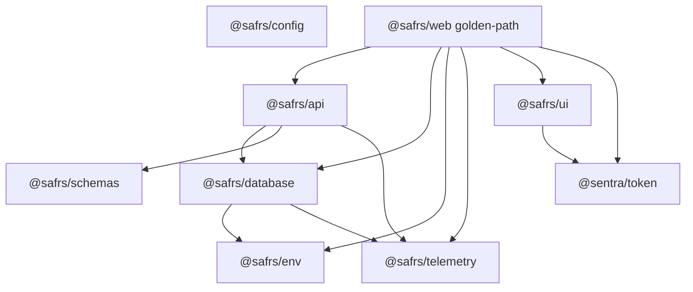

# Shared packages (root)

**Canonical:** `packages/README.md`. Changes are R2.

Root `packages/` holds reusable, product-neutral capabilities. They are **not** the runtime dependency pattern for new capsules (ADR 0006). Standalone capsules must not resolve these after extraction.

**Allowed consumers today:** the legacy golden-path app, and (narrowly) control-center for `@sentra/token` / `@safrs/config`. Those couplings are current-state defects or operator-surface exceptions, not templates.

## Inventory

| Package | Directory | Role |
| --- | --- | --- |
| `@safrs/config` | `packages/config/` | Shared tsconfig presets |
| `@safrs/schemas` | `packages/schemas/` | Zod demo contracts (barrel); `src/sentrabot/` not exported |
| `@safrs/env` | `packages/env/` | t3-env client/server split |
| `@safrs/telemetry` | `packages/telemetry/` | OpenTelemetry + Hono middleware |
| `@sentra/token` | `packages/token/` | Sentra design tokens (authoring source) |
| `@safrs/ui` | `packages/ui/` | `StatusCard` primitive |
| `@safrs/database` | `packages/database/` | Prisma + Postgres, reset guard, seed |
| `@safrs/api` | `packages/api/` | Hono routes, typed client, OpenAPI |
| *(incomplete)* | `packages/auth/` | Better Auth sources without a shipped package.json — [auth.md](auth.md) |

`packages/auth/src` exists with Better Auth + Prisma adapter in `node_modules`, but there is no published workspace `package.json` in the listing used for this wiki. Do not treat `@safrs/auth` as a shipped package.

## Dependency graph (legacy golden-path)

SentraBot, Kediri, and Smartboard keep **capsule-local** packages (`@sentrabot/*`, `@kediri/*`, vendored token tarball). Those are not these packages.

## Related

- [API](api.md)
- [Database](database.md)
- [Auth](auth.md)
- [Token](token.md)
- [Golden path](../projects/golden-path.md)
- [Capsule sovereignty](../governance/capsule-sovereignty.md)
