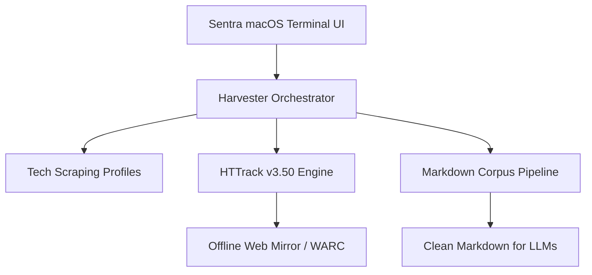

# Architecture Specification: Sentra Web Harvester

## Overview
Sentra Web Harvester menggabungkan arsitektur Dual-Engine:
1. **Core Binary Engine**: `C:\Program Files\WinHTTrack\httrack.exe` (v3.50-2) untuk spidering berkecepatan tinggi, socket multiplexing, filter MIME, dan rewriting path link secara offline.
2. **AI Markdown Corpus Pipeline**: Node.js v24 + Cheerio + Turndown untuk mengekstrak artikel, membersihkan chrome/banner/ads, serta menghasilkan markdown bersih dengan format syntax highlighting code block.

## Component Diagram

